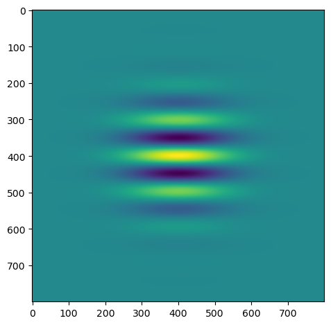
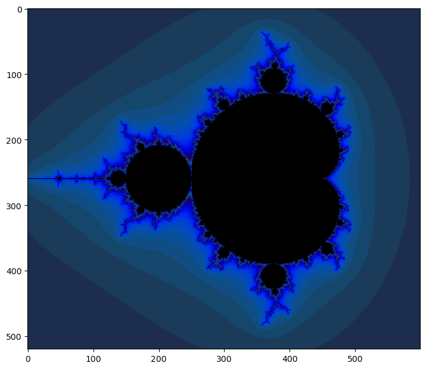
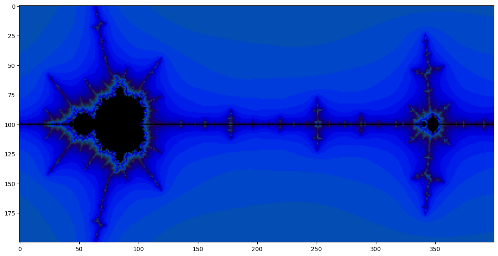
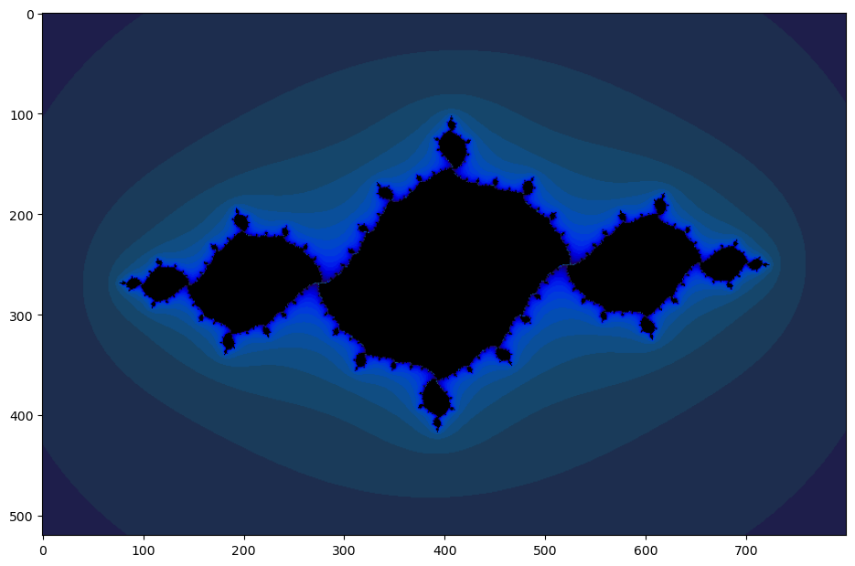

# Gabor Filter
- Gabor is a convolution filter representing a combination of gausian and a sinusoidal term.
- The gausian component provides the weights and the sine component provides directionality.
- Gabor can be used to generate features that represent texture and edges.



# Mandelbrot Set
- It is a set of complex numbers for which the orbit of Zn does not tend to infinity.
- Obtained from: Zn+1 = Zn^2 + c
- Here, image is generated from the number of steps required to reach |Zn| = 2 ==> Re{Zn}^2 + Im{Zn}^2 = 4



### Zoomed-in Mandelbrot Set



# Julia Set
The Julia Set Fractal is dependent upon complex numbers - numbers which have both a real and 'imaginary' component i, i being defined as the square root of -1. A complex number can formally be expressed as:
```
c = r + b * i
```
Where c is the complex number, r is the real component and b the imaginary component. To create the bounded set, we first create a mathematical function f(z) which accepts a complex number, a simple example is the following equation...
```
z = z2 + c
```
where, c is a constant complex number. The complex number z can be updated iteratively.



# Gosper Curve (Flowsnake)
- The Gosper curve, also known as Peano-Gosper Curve, named after Bill Gosper, also known as the flowsnake (a spoonerism of snowflake), is a space-filling curve whose limit set is rep-7. It is a fractal curve similar in its construction to the dragon curve and the Hilbert curve.
- The Gosper curve can also be used for efficient hierarchical hexagonal clustering and indexing.

.png)
